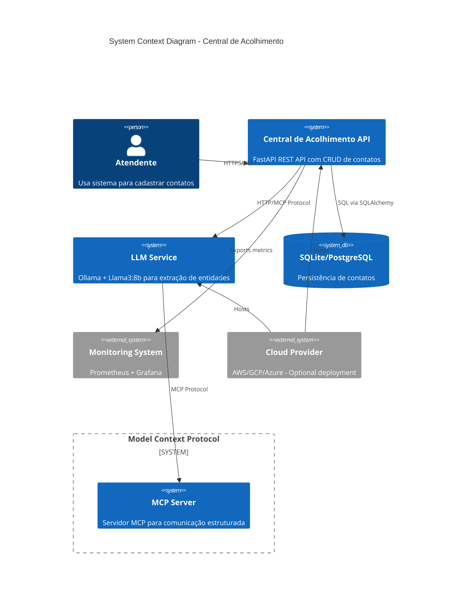

# 3. Context and Scope

## 3.1 Business Context

### Domain Overview
A **Central de Acolhimento** é um sistema de gestão para centros que prestam atendimento e apoio a pessoas em situação de vulnerabilidade (acolhimento social, apoio psicológico, orientação jurídica, etc.). O sistema permite que atendentes cadastrem informações de contatos de forma rápida e automatizada, utilizando processamento de linguagem natural para extrair dados estruturados a partir de texto livre.

### Business Model
- **Primary Users**: Atendentes que recebem ligações, mensagens ou contatos presenciais
- **Workflow**: 
  1. Atendente recebe informação de forma livre (voz transcrita, WhatsApp, chat, etc.)
  2. Sistema processa texto via LLM e extrai: nome, telefone, email, motivo do contato, urgência
  3. Dados são persistidos automaticamente no banco de dados
  4. Integração opcional com MCP (Model Context Protocol) permite enriquecimento de contexto
  5. Exportação de relatórios para gestão e compliance

### Value Proposition
- **Efficiency**: Reduz tempo de cadastro de ~3 minutos (manual) para ~10 segundos (automatizado)
- **Accuracy**: LLM elimina erros de digitação e padroniza formato de dados
- **Privacy**: Tudo processado localmente, garantindo LGPD compliance
- **Scalability**: Suporta crescimento de demanda sem proporcional aumento de equipe

## 3.2 System Context

### Architectural Context Diagram



### Context Level Architecture

| Element | Description | Relationship to System |
|---------|-------------|------------------------|
| **Atendentes** | Usuários finais que utilizam a API para cadastrar contatos | Interagem via REST API, autenticados via JWT |
| **Central de Acolhimento API** | Sistema principal que expõe endpoints CRUD | Arquitetura multi-repo: API separada de LLM service |
| **LLM Service** | Serviço separado (containerizado) que processa linguagem natural | Comunica via HTTP/MCP, extrai entidades de texto |
| **SQLite/PostgreSQL Database** | Persistência de dados de contatos | Acesso via SQLAlchemy ORM, migrations via Alembic |
| **MCP Server** | Servidor Model Context Protocol para comunicação estruturada com LLM | Formato JSON-RPC, bidirectional communication |
| **Monitoring System** | Prometheus para métricas, Grafana para dashboards | API exporta métricas via Prometheus exporter pattern |
| **Cloud Provider** | AWS/GCP/Azure - ambiente de deployment opcional | Host de containers (Kubernetes), managed databases |

## 3.3 Technical Context

### Integration Points

#### 3.3.1 MCP Integration (Model Context Protocol)
**Purpose**: Comunicar com LLM de forma estruturada e padronizada

**Protocol**: JSON-RPC over HTTP (bidirectional SSE/WebSocket opcional)

**Communication Flow**:
```python
# Example MCP request/response
Request:
{
  "jsonrpc": "2.0",
  "method": "tools/extract_entities",
  "params": {
    "text": "Novo contato: Maria Silva, tel: 11-9999-8888, motivo: apoio emocional",
    "entity_types": ["nome", "telefone", "email", "motivo", "data"]
  },
  "id": "req_123"
}

Response:
{
  "jsonrpc": "2.0",
  "result": {
    "entities": {
      "nome": "Maria Silva",
      "telefone": "11-9999-8888",
      "motivo": "apoio emocional",
      "confianca": 0.92
    }
  },
  "id": "req_123"
}
```

**MCP Server Responsibilities**:
- Expor tools/resources para LLM acessar contexto
- Processar prompts e retornar respostas estruturadas
- Gerenciar sessões de conversação para manter contexto

**MCP Client Responsibilities (API Side)**:
- Invocar MCP tools via JSON-RPC
- Tratar timeouts e retries (exponential backoff)
- Fallback para cadastro manual se LLM/MCP indisponível

#### 3.3.2 LLM Service Integration
**Protocol**: HTTP REST + MCP JSON-RPC

**Endpoints**:
- `POST /mcp/tools/extract_entities` - Extrai entidades de texto livre
- `GET /mcp/resources/prompt_templates` - Obtém templates de prompts
- `POST /mcp/completions` - Geração de texto genérico (fallback)

**Load Balancing**: Kubernetes Service com múltiplas réplicas do LLM pod (se escalado)

#### 3.3.3 Database Integration
**Schema**:
```python
class Contato(Base):
    id: int
    nome: str
    telefone: str
    email: Optional[str]
    motivo: str
    data_cadastro: datetime
    status_mcp: str  # "pendente", "sincronizado", "erro"
    mcp_synced_at: Optional[datetime]
    metadata: JSON  # Dados extras extraídos via LLM
```

**ORM**: SQLAlchemy 2.0 async, migrations via Alembic

**Connection Pooling**: SQLAlchemy pool_size=10, max_overflow=20

## 3.4 Scope Definition

### In-Scope (MVP) - Detailed

#### 3.4.1 Core Features
1. **CRUD API** (Create, Read, Update, Delete de contatos)
   - Endpoints RESTful via FastAPI
   - Validação via Pydantic schemas
   - OpenAPI/Swagger auto-documentation

2. **LLM-Based Entity Extraction**
   - Integração com Ollama via MCP
   - Extração: nome, telefone, email, motivo do contato
   - Fallback manual se LLM indisponível

3. **Data Persistence**
   - SQLite para desenvolvimento local
   - PostgreSQL para produção
   - Alembic migrations

4. **MCP Protocol Integration**
   - MCP client na API
   - MCP server no LLM service
   - Bidirectional communication

5. **Export Functionality**
   - Exportação para Excel (.xlsx)
   - Filtros por data, status, motivo

6. **Infrastructure as Code**
   - Terraform modules cloud-agnostic
   - Kubernetes manifests reutilizáveis

#### 3.4.2 Observability
- Structured logging (JSON)
- Prometheus metrics export
- Health check endpoints
- Grafana dashboards básicos

#### 3.4.3 Security (Basic)
- JWT authentication
- HTTPS enforcement
- Input validation via Pydantic
- SQL injection prevention (ORM)

### Out-of-Scope (Future Enhancements)

#### 3.4.4 Not Included in MVP
- ❌ Web UI completa (Streamlit é opcional, focar em API REST)
- ❌ Real-time notifications (WebSockets, push)
- ❌ Multi-tenancy/multi-organization
- ❌ Fine-tuning de modelo LLM customizado
- ❌ Integração WhatsApp, Telegram (apenas REST API)
- ❌ Workflow engine complexo (apenas regras simples)
- ❌ GPU cluster optimization (CPU first)
- ❌ BI/Analytics dashboard avançado
- ❌ Full-text search no database
- ❌ Audit log detalhado (apenas logs básicos no MVP)
- ❌ Disaster recovery automatizado (backup manual)
- ❌ CI/CD pipeline completo (setup básico)

## 3.5 System Boundary

### What IS Part of the System
- FastAPI REST API application
- MCP client for LLM communication
- SQLAlchemy models and CRUD operations
- Alembic database migrations
- Pydantic schemas for validation
- Docker containers (API, LLM service)
- Terraform IaC code
- Kubernetes deployment manifests
- Logging, metrics, health checks

### What IS NOT Part of the System
- Physical infrastructure (datacenters, networks)
- Cloud provider services (managed databases, object storage são usados mas não "possuídos")
- User devices (browsers, mobile apps)
- Third-party APIs externas (apenas LLM local)
- Monitoring infrastructure (Prometheus/Grafana são externos)
- CI/CD runners (GitHub Actions são externos)

## 3.6 External Dependencies

| Dependency | Type | Purpose | Impact if Unavailable |
|------------|------|---------|----------------------|
| **Ollama (LLM Runtime)** | External Service | Executa modelo Llama3:8b | Sistema deve degradar para cadastro manual |
| **MCP Protocol** | Standard Protocol | Comunicação estruturada LLM | Fallback para HTTP direto se MCP falhar |
| **Python 3.11+** | Runtime | Python interpreter | Sistema não funciona |
| **Docker** | Runtime | Containerização | Deploy fica impossível sem alternativa |
| **Kubernetes** (production) | Orchestration | Container orchestration | Requer bare metal ou cloud específica |
| **PostgreSQL** (production) | Database | Persistência de dados | SQLite fallback possível mas não ideal |
| **Terraform** | Tool | IaC | Deploy manual possível mas trabalhoso |
| **Prometheus** (observability) | Monitoring | Métricas e alertas | Sistema funcional mas sem visibility |

## 3.7 Success Criteria

### Business Success
- ✅ Tempo de cadastro reduzido de 3 min para < 1 min
- ✅ Acurácia de extração > 90% (nome, telefone, motivo)
- ✅ Zero vazamentos de dados (LGPD compliant)
- ✅ Exportação de relatórios funcionando

### Technical Success
- ✅ P95 latência de API < 3 segundos
- ✅ Uptime > 99.5%
- ✅ Test coverage > 80%
- ✅ Documentação Arc42 completa
- ✅ Deployment cloud-agnostic funcionando

### User Acceptance
- ✅ Atendentes conseguem cadastrar 95%+ contatos via LLM
- ✅ Fallback manual funciona quando LLM indisponível
- ✅ Interface/API clara e intuitiva
- ✅ Exportação de dados satisfatória para gestão

## 3.8 Risks & Assumptions

### Risks
1. **LLM Hallucination**: Llama3 pode extrair entidades incorretas → mitigação: validação humana antes de commit
2. **Performance**: LLM local em CPU pode ser lento → mitigação: aceitar latência, considerar GPU futuro
3. **Cloud Lock-in**: Dependência de vendor específico → mitigação: Terraform multi-cloud, Kubernetes padrão
4. **Data Loss**: SQLite single-instance pode corromper → mitigação: migrar para PostgreSQL early

### Assumptions
- ✅ Usuários têm acesso a Docker/Kubernetes em produção
- ✅ Hardware suporta llama3:8b (8GB+ RAM)
- ✅ Rede interna permite comunicação API ↔ LLM service
- ✅ LGPD compliance é requirement obrigatório (não negociável)
- ✅ MVP não precisa escalar além de 1000 contatos/dia inicialmente
