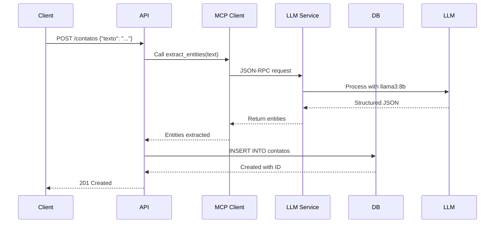

# 5. Building Blocks

## 5.1 Level 1: System Decomposition

### System Overview
O sistema é dividido em **2 containers principais** + **1 database**:

```
┌─────────────────────────────────────────────────────────┐
│                   Central de Acolhimento                 │
│                                                          │
│  ┌──────────────┐         ┌──────────────┐            │
│  │  API Service │◄──MCP───►│  LLM Service │            │
│  │  (FastAPI)   │  HTTP    │  (Ollama)    │            │
│  │              │         │              │            │
│  │ - CRUD       │         │ - Entity     │            │
│  │ - MCP Client │         │   Extraction │            │
│  │ - Auth       │         │ - MCP Server │            │
│  └──────┬───────┘         └─────────────┘            │
│         │                                              │
│         │ SQLAlchemy                                  │
│         ▼                                              │
│  ┌──────────────┐                                      │
│  │   Database   │                                      │
│  │ SQLite/PG    │                                      │
│  └──────────────┘                                      │
└─────────────────────────────────────────────────────────┘
```

### Building Blocks Level 1

| Building Block | Responsibility | Technology |
|----------------|----------------|------------|
| **API Service** | Expose REST endpoints, orchestrate CRUD, integrate with LLM via MCP | FastAPI, Python 3.11+ |
| **LLM Service** | Process natural language, extract entities using Llama3:8b | Ollama, MCP Server |
| **Database** | Persist contact data, manage schema via migrations | SQLite (dev), PostgreSQL (prod) |

## 5.2 Level 2: API Service Decomposition

### API Service Internal Architecture

```
┌──────────────────────────────────────────────────────────┐
│                    API Service Container                  │
│                                                           │
│  ┌─────────────────────────────────────────────────┐   │
│  │ Presentation Layer                               │   │
│  │ - api/routers.py (Endpoints)                    │   │
│  │ - api/middleware.py (Auth, CORS)                │   │
│  │ - core/dependencies.py (DB session)             │   │
│  └─────────────────────────────────────────────────┘   │
│                           ↓                              │
│  ┌─────────────────────────────────────────────────┐   │
│  │ Business Logic Layer                            │   │
│  │ - services/crud_service.py (CRUD operations)    │   │
│  │ - services/llm_integration.py (LLM orchestration│   │
│  │ - mcp/client.py (MCP protocol client)          │   │
│  └─────────────────────────────────────────────────┘   │
│                           ↓                              │
│  ┌─────────────────────────────────────────────────┐   │
│  │ Data Access Layer                                │   │
│  │ - models/contato.py (SQLAlchemy model)          │   │
│  │ - crud/contato.py (Repository pattern)         │   │
│  │ - database.py (Connection, session management)   │   │
│  └─────────────────────────────────────────────────┘   │
│                           ↓                              │
│  ┌─────────────────────────────────────────────────┐   │
│  │ Schema & Validation                              │   │
│  │ - schemas/contato.py (Pydantic models)          │   │
│  └─────────────────────────────────────────────────┘   │
└──────────────────────────────────────────────────────────┘
```

### Building Blocks Level 2 (API)

| Building Block | Responsibility | Dependencies |
|----------------|----------------|--------------|
| **api/routers/** | Define REST endpoints, handle HTTP requests/responses | services, schemas, dependencies |
| **services/crud_service.py** | Business logic for CRUD operations | crud, schemas, mcp/client |
| **services/llm_integration.py** | Orchestrate entity extraction via LLM | mcp/client, models |
| **mcp/client.py** | MCP protocol client implementation | requests, JSON-RPC |
| **models/contato.py** | SQLAlchemy ORM model for Contato entity | database, Base |
| **crud/contato.py** | Repository pattern for database operations | models, database session |
| **schemas/contato.py** | Pydantic models for validation/serialization | pydantic |

### Code Structure (API)

```
app/
├── __init__.py
├── main.py                      # FastAPI app instance
├── api/
│   ├── __init__.py
│   ├── deps.py                  # Dependencies (DB session, auth)
│   ├── middleware.py            # Auth, CORS, logging middleware
│   └── routers/
│       ├── __init__.py
│       └── contatos.py          # GET, POST, PUT, DELETE endpoints
├── core/
│   ├── config.py                # Settings (pydantic-settings)
│   ├── database.py              # SQLAlchemy engine, session factory
│   └── security.py              # JWT, password hashing
├── models/
│   ├── __init__.py
│   └── contato.py               # SQLAlchemy model
├── schemas/
│   ├── __init__.py
│   └── contato.py               # Pydantic models (ContatoCreate, ContatoUpdate, ContatoOut)
├── crud/
│   ├── __init__.py
│   └── contato.py               # Repository pattern
├── services/
│   ├── __init__.py
│   ├── crud_service.py          # Business logic orchestration
│   └── llm_integration.py       # LLM processing orchestration
└── mcp/
    ├── __init__.py
    ├── client.py                # MCP JSON-RPC client
    └── tools.py                 # MCP tools definitions
```

## 5.3 Level 2: LLM Service Decomposition

### LLM Service Internal Architecture

```
┌──────────────────────────────────────────────────────────┐
│                   LLM Service Container                   │
│                                                           │
│  ┌─────────────────────────────────────────────────┐   │
│  │ MCP Server Layer                                │   │
│  │ - mcp/server.py (JSON-RPC handler)             │   │
│  │ - mcp/resources.py (Context management)         │   │
│  │ - mcp/tools.py (Tool definitions)              │   │
│  └─────────────────────────────────────────────────┘   │
│                           ↓                              │
│  ┌─────────────────────────────────────────────────┐   │
│  │ Ollama Integration                              │   │
│  │ - ollama/client.py (HTTP client to Ollama)      │   │
│  │ - ollama/prompts.py (Prompt templates)         │   │
│  └─────────────────────────────────────────────────┘   │
│                           ↓                              │
│  ┌─────────────────────────────────────────────────┐   │
│  │ Entity Extraction Engine                        │   │
│  │ - extraction/llm_extractor.py (Main extractor)  │   │
│  │ - extraction/validators.py (Data validation)    │   │
│  └─────────────────────────────────────────────────┘   │
└──────────────────────────────────────────────────────────┘
```

### Building Blocks Level 2 (LLM)

| Building Block | Responsibility | Dependencies |
|----------------|----------------|--------------|
| **mcp/server.py** | Handle MCP JSON-RPC requests, route to tools | mcp/tools, mcp/resources |
| **ollama/client.py** | HTTP client to Ollama API (localhost:11434) | requests |
| **ollama/prompts.py** | Prompt templates para entity extraction | jinja2 (optional) |
| **extraction/llm_extractor.py** | Main logic for entity extraction from text | ollama/client, ollama/prompts |
| **extraction/validators.py** | Validate extracted entities (regex, format) | custom validators |

### Code Structure (LLM)

```
llm-service/
├── Dockerfile
├── docker-compose.yml
├── ollama/
│   ├── __init__.py
│   ├── client.py              # HTTP client to Ollama
│   └── prompts.py              # Prompt templates
├── mcp/
│   ├── __init__.py
│   ├── server.py               # MCP JSON-RPC server
│   ├── tools.py                # Tool: extract_entities
│   └── resources.py            # Context resources
├── extraction/
│   ├── __init__.py
│   ├── llm_extractor.py        # Main extraction logic
│   └── validators.py           # Validate phone, email, etc.
└── main.py                     # Entry point (start MCP server)
```

## 5.4 Level 3: Detailed Components

### 5.4.1 API Service Components

#### api/routers/contatos.py
```python
from fastapi import APIRouter, Depends, HTTPException
from sqlalchemy.orm import Session
from app.schemas.contato import ContatoCreate, ContatoUpdate, ContatoOut
from app.services.crud_service import ContatoService
from app.api.deps import get_db

router = APIRouter(prefix="/contatos", tags=["contatos"])

@router.post("/", response_model=ContatoOut, status_code=201)
async def create_contato(
    data: ContatoCreate,
    service: ContatoService = Depends(),
    db: Session = Depends(get_db)
):
    """Create new contact via LLM entity extraction."""
    return await service.create_contato(db, data)

@router.get("/{id}", response_model=ContatoOut)
async def get_contato(id: int, service: ContatoService = Depends()):
    """Get contact by ID."""
    return await service.get_contato(id)

@router.put("/{id}", response_model=ContatoOut)
async def update_contato(
    id: int,
    data: ContatoUpdate,
    service: ContatoService = Depends()
):
    """Update existing contact."""
    return await service.update_contato(id, data)

@router.delete("/{id}", status_code=204)
async def delete_contato(id: int, service: ContatoService = Depends()):
    """Delete contact."""
    await service.delete_contato(id)

@router.get("/", response_model=list[ContatoOut])
async def list_contatos(
    skip: int = 0,
    limit: int = 100,
    filters: dict = None,
    service: ContatoService = Depends()
):
    """List all contacts with pagination and filters."""
    return await service.list_contatos(skip, limit, filters)

@router.get("/export/excel")
async def export_to_excel(service: ContatoService = Depends()):
    """Export contacts to Excel file."""
    return await service.export_to_excel()
```

#### services/crud_service.py
```python
from app.models.contato import Contato
from app.schemas.contato import ContatoCreate, ContatoUpdate
from app.crud.contato import ContatoRepository
from app.services.llm_integration import LLMIntegration
from sqlalchemy.orm import Session

class ContatoService:
    def __init__(self):
        self.repository = ContatoRepository()
        self.llm = LLMIntegration()
    
    async def create_contato(self, db: Session, data: ContatoCreate) -> Contato:
        """Orchestrate contact creation: LLM extraction → validation → persistence."""
        # Extract entities from text via LLM
        entities = await self.llm.extract_entities(data.texto_livre)
        
        # Validate and create
        contato = self.repository.create(db, entities)
        return contato
    
    async def get_contato(self, id: int) -> Contato:
        return await self.repository.get(id)
    
    # ... other CRUD methods
```

#### mcp/client.py
```python
import httpx
from typing import Dict, Any

class MCPClient:
    def __init__(self, base_url: str = "http://localhost:11434"):
        self.base_url = base_url
    
    async def call_tool(self, tool_name: str, params: Dict[str, Any]) -> Dict[str, Any]:
        """Call MCP tool via JSON-RPC."""
        payload = {
            "jsonrpc": "2.0",
            "method": f"tools/{tool_name}",
            "params": params,
            "id": f"req_{id}"
        }
        
        async with httpx.AsyncClient(timeout=30.0) as client:
            response = await client.post(
                f"{self.base_url}/mcp",
                json=payload
            )
            response.raise_for_status()
            return response.json()["result"]
    
    async def extract_entities(self, text: str) -> Dict[str, str]:
        """Extract named entities from free text."""
        params = {
            "text": text,
            "entity_types": ["nome", "telefone", "email", "motivo"]
        }
        result = await self.call_tool("extract_entities", params)
        return result["entities"]
```

#### models/contato.py
```python
from sqlalchemy import Column, Integer, String, DateTime, JSON, Boolean
from sqlalchemy.sql import func
from app.core.database import Base

class Contato(Base):
    __tablename__ = "contatos"
    
    id = Column(Integer, primary_key=True, index=True)
    nome = Column(String, nullable=False, index=True)
    telefone = Column(String, nullable=False, index=True)
    email = Column(String, nullable=True)
    motivo = Column(String, nullable=False)
    data_cadastro = Column(DateTime(timezone=True), server_default=func.now())
    status_mcp = Column(String, default="pendente")  # pendente, sincronizado, erro
    metadata = Column(JSON, nullable=True)  # Extra data extracted by LLM
    created_at = Column(DateTime(timezone=True), server_default=func.now())
    updated_at = Column(DateTime(timezone=True), onupdate=func.now())
    
    def __repr__(self):
        return f"<Contato id={self.id} nome={self.nome}>"
```

### 5.4.2 LLM Service Components

#### mcp/server.py
```python
from fastapi import FastAPI, Request
from typing import Dict, Any
import json

app = FastAPI(title="MCP LLM Server")

@app.post("/mcp")
async def handle_mcp_request(request: Request):
    """Handle MCP JSON-RPC requests."""
    data = await request.json()
    
    method = data.get("method")
    params = data.get("params", {})
    
    if method == "tools/extract_entities":
        result = await extract_entities_handler(params)
    else:
        raise ValueError(f"Unknown method: {method}")
    
    return {
        "jsonrpc": "2.0",
        "result": result,
        "id": data.get("id")
    }

async def extract_entities_handler(params: Dict[str, Any]) -> Dict[str, Any]:
    """Handle entity extraction tool."""
    text = params.get("text")
    entity_types = params.get("entity_types", [])
    
    # Call Ollama to extract entities
    entities = await call_ollama_extraction(text, entity_types)
    
    return {"entities": entities}
```

#### ollama/client.py
```python
import httpx
from typing import Dict, Any

class OllamaClient:
    def __init__(self, base_url: str = "http://localhost:11434"):
        self.base_url = base_url
    
    async def generate(self, prompt: str, model: str = "llama3:8b") -> str:
        """Generate text using Ollama."""
        payload = {
            "model": model,
            "prompt": prompt,
            "stream": False
        }
        
        async with httpx.AsyncClient(timeout=60.0) as client:
            response = await client.post(
                f"{self.base_url}/api/generate",
                json=payload
            )
            response.raise_for_status()
            return response.json()["response"]
```

#### extraction/llm_extractor.py
```python
from ollama.client import OllamaClient
from ollama.prompts import ENTITY_EXTRACTION_PROMPT
from extraction.validators import validate_phone, validate_email
from typing import Dict, Any

class EntityExtractor:
    def __init__(self):
        self.client = OllamaClient()
    
    async def extract_entities(self, text: str) -> Dict[str, Any]:
        """Extract named entities from free text using LLM."""
        prompt = ENTITY_EXTRACTION_PROMPT.format(text=text)
        
        llm_response = await self.client.generate(prompt)
        
        # Parse JSON response
        import json
        entities = json.loads(llm_response)
        
        # Validate extracted entities
        if entities.get("telefone"):
            entities["telefone"] = validate_phone(entities["telefone"])
        if entities.get("email"):
            entities["email"] = validate_email(entities["email"])
        
        return entities
```

## 5.5 Building Block Interactions

### Request Flow: Create Contact



## 5.6 Building Block Dependencies

### Dependency Graph

```
┌─────────────────┐
│   FastAPI App   │
└────────┬────────┘
         │
         ▼
┌─────────────────────┐
│  api/routers/       │──► services/crud_service.py
└─────────────────────┘          │
         │                        ▼
         │              ┌─────────────────────────┐
         │              │ services/llm_integration│
         │              └──────────┬──────────────┘
         │                         ▼
         │              ┌─────────────────────────┐
         │              │     mcp/client.py        │
         │              └─────────────────────────┘
         │                         │
         ▼                         ▼
┌─────────────────────┐  ┌─────────────────────────┐
│  crud/contato.py    │  │   LLM Service (MCP)     │
└────────┬────────────┘  └─────────────────────────┘
         │
         ▼
┌─────────────────────┐
│  models/contato.py  │──► database.py (SQLAlchemy)
└─────────────────────┘
         │
         ▼
┌─────────────────────┐
│   SQLite/PostgreSQL │
└─────────────────────┘
```

## 5.7 Building Block Responsibilities

### API Service Responsibilities
- Receive HTTP requests from clients
- Validate input data via Pydantic schemas
- Authenticate/authorize requests (JWT)
- Orchestrate business logic (CRUD operations)
- Call LLM service via MCP protocol
- Persist data to database
- Return responses to clients
- Handle errors gracefully
- Export contacts to Excel

### LLM Service Responsibilities
- Receive MCP JSON-RPC requests
- Process natural language via Llama3:8b
- Extract structured entities from free text
- Validate extracted data (format, semantics)
- Return structured JSON responses
- Handle LLM errors/timeouts gracefully

### Database Responsibilities
- Store contact data persistently
- Support transactions (ACID)
- Enable filtering, sorting, pagination
- Provide database migrations (Alembic)
- Backup/restore capabilities
