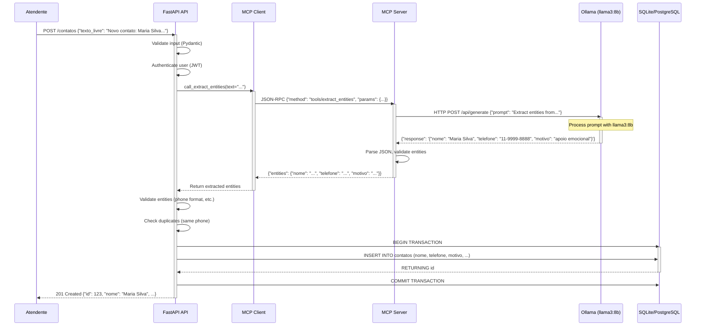
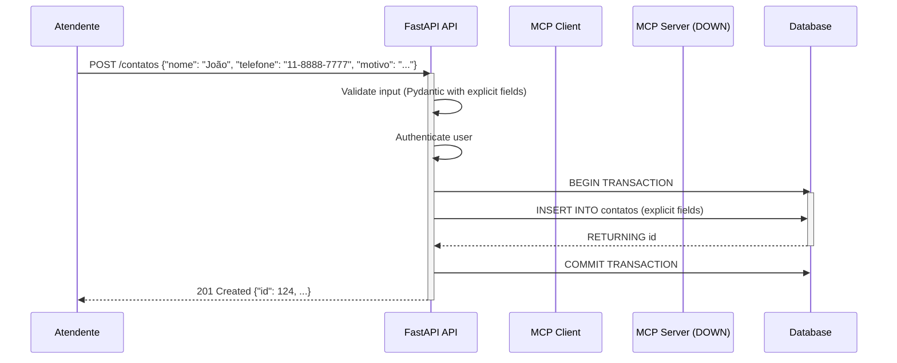
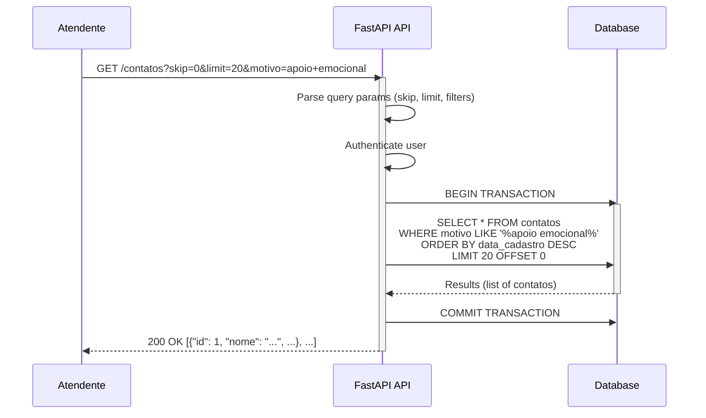
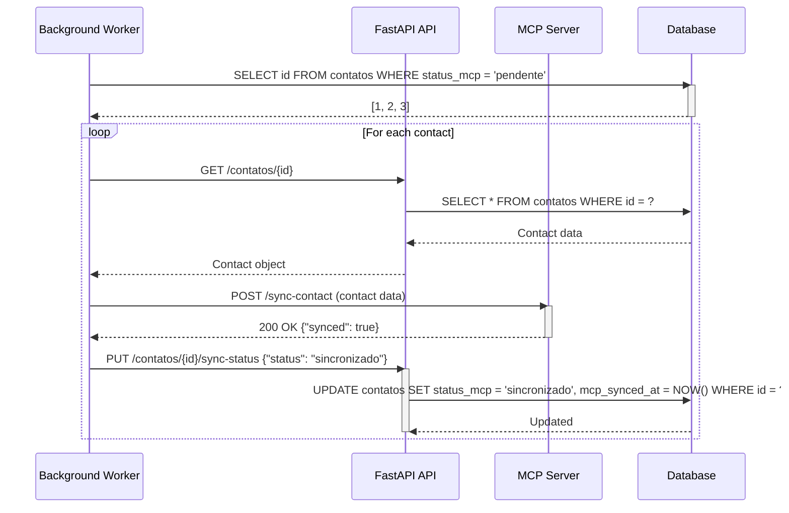
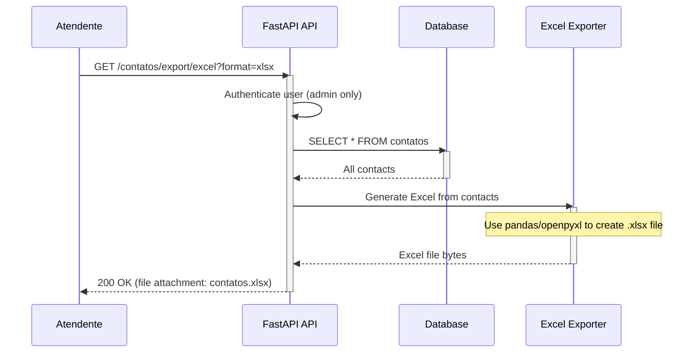

# 6. Runtime View

## 6.1 Runtime Scenario 1: Create Contact via LLM Extraction

### Scenario Description
Atendente envia texto livre via API (ex.: "Novo contato: Maria Silva, telefone 11-9999-8888, motivo: apoio emocional"). Sistema extrai entidades via LLM e persiste no banco.

### Sequence Diagram



### Step-by-Step Execution
1. **Request Received**: API receives POST request with `texto_livre` field
2. **Validation**: Pydantic schema validates input format
3. **Authentication**: JWT token validated (optional in dev, required in prod)
4. **MCP Call**: API's MCP client invokes MCP server with extraction request
5. **LLM Processing**: MCP server sends prompt to Ollama, llama3:8b processes and returns JSON
6. **Entity Validation**: Extracted entities validated (phone format, email format, etc.)
7. **Database Insert**: Validated entities inserted into database
8. **Response**: API returns 201 Created with full contato object

### Performance Characteristics
- **Total Latency**: ~2-5 seconds (majority from LLM processing)
- **LLM Processing**: ~1-3 seconds (varies with hardware, llama3:8b on CPU)
- **Database Insert**: <100ms (SQLite/PostgreSQL both very fast for single insert)
- **API Overhead**: <50ms

## 6.2 Runtime Scenario 2: Manual Fallback (LLM Unavailable)

### Scenario Description
LLM service está indisponível (timeout, erro, etc.). Sistema permite cadastro manual via campos explícitos.

### Sequence Diagram



### Alternative: LLM Timeout
```
User->>API: POST /contatos {"texto_livre": "..."}
API->>MC: Call extract_entities(...)
MC->>MCP: JSON-RPC request
Note over MCP: Request times out after 30s
MC-->>API: TimeoutError("LLM service unavailable")
API->>API: Fallback to manual extraction (prompt user to fill explicit fields)
API-->>User: 422 Unprocessable Entity {"error": "LLM unavailable, please provide explicit fields"}
```

## 6.3 Runtime Scenario 3: List Contacts with Pagination

### Scenario Description
Atendente lista contatos cadastrados com paginação e filtros opcionais.

### Sequence Diagram



### Performance
- **Latency**: ~50-200ms depending on dataset size
- **Database Query**: Complex queries with filters indexed properly
- **Memory**: Pagination limits result set size

## 6.4 Runtime Scenario 4: Update Contact Status

### Scenario Description
Sistema atualiza status de sincronização com MCP após processar contato em background job.

### Sequence Diagram



## 6.5 Runtime Scenario 5: Error Handling & Retries

### LLM Retry Logic

```mermaid
sequenceDiagram
    participant API as FastAPI API
    participant MC as MCP Client
    participant MCP as MCP Server
    
    API->>MC: Call extract_entities(text)
    
    loop Retry Logic (max 3 attempts)
        MC->>MCP: JSON-RPC request
        alt Success
            MCP-->>MC: Return entities
            break loop
        else Timeout/Failure
            Note over MC: Wait exponential backoff (1s, 2s, 4s)
            MC->>MCP: Retry request
        end
    end
    
    alt All retries failed
        MC-->>API: LLMError("LLM unavailable after 3 attempts")
        API->>API: Fallback: require explicit fields
        API-->>Client: 422 Unprocessable Entity
    else Success
        MC-->>API: Return entities
    end
```

### Circuit Breaker Pattern
- **Closed State**: Normal operation, requests pass through
- **Open State**: After 3 consecutive failures, circuit opens, immediate failure (no LLM calls)
- **Half-Open State**: After 30s, test with single request; if success, close circuit

## 6.6 Runtime Scenario 6: Export to Excel

### Sequence Diagram



### Performance
- **Small Datasets** (<1000 contacts): <1s
- **Large Datasets** (10000+ contacts): May require streaming or background job

## 6.7 Concurrent Request Handling

### Architecture: FastAPI with Async Workers

```
┌─────────────────────────────────────────┐
│           FastAPI App                   │
│                                         │
│  ┌─────────┐  ┌─────────┐  ┌─────────┐ │
│  │ Worker1 │  │ Worker2 │  │ Worker3 │ │ Async workers handle requests
│  └─────────┘  └─────────┘  └─────────┘ │ simultaneously
│         │         │            │       │
│         └─────────┴────────────┘       │
│                   │                    │
└───────────────────┼────────────────────┘
                    │
                    ▼
          ┌──────────────────┐
          │  Database Pool    │  Connection pooling handles
          │  (SQLAlchemy)     │  concurrent DB access
          └─────────┬─────────┘
                    │
                    ▼
              SQLite/PostgreSQL
```

### Concurrency Limits
- **API Workers**: Uvicorn with ~4 workers by default, scale to N cores
- **Database Connections**: Pool size = 10, max overflow = 20
- **LLM Calls**: Sequential per request (async but single LLM instance, no concurrent calls to avoid overload)

## 6.8 State Management

### Stateless API
- API is stateless: all state in database
- JWT tokens stateless (no server-side session)
- Enables horizontal scaling (multiple replicas)

### Database State
- All contact data persisted in database
- Transactions ensure ACID compliance
- Migrations version schema changes

### LLM State (Stateless)
- MCP protocol stateless (each request independent)
- No conversational context across requests
- Prompts self-contained

## 6.9 Resource Utilization

### Typical Resource Usage (Single Request)

| Resource | Usage | Notes |
|----------|-------|-------|
| **CPU** | ~5-10% | Mostly idle, spikes during LLM processing |
| **Memory (API)** | ~100-200MB | Python + FastAPI + dependencies |
| **Memory (LLM)** | ~8-16GB | llama3:8b requires substantial RAM |
| **Network** | <1MB per request | JSON payloads small |
| **Database** | <1MB storage per 1000 contacts | SQLite is efficient, PostgreSQL similar |

### Scalability Considerations
- **Horizontal API Scaling**: Multiple API pods possible (stateless)
- **LLM Scaling**: More complex (GPU memory, may need single instance or queue)
- **Database Scaling**: PostgreSQL can scale via read replicas if needed
