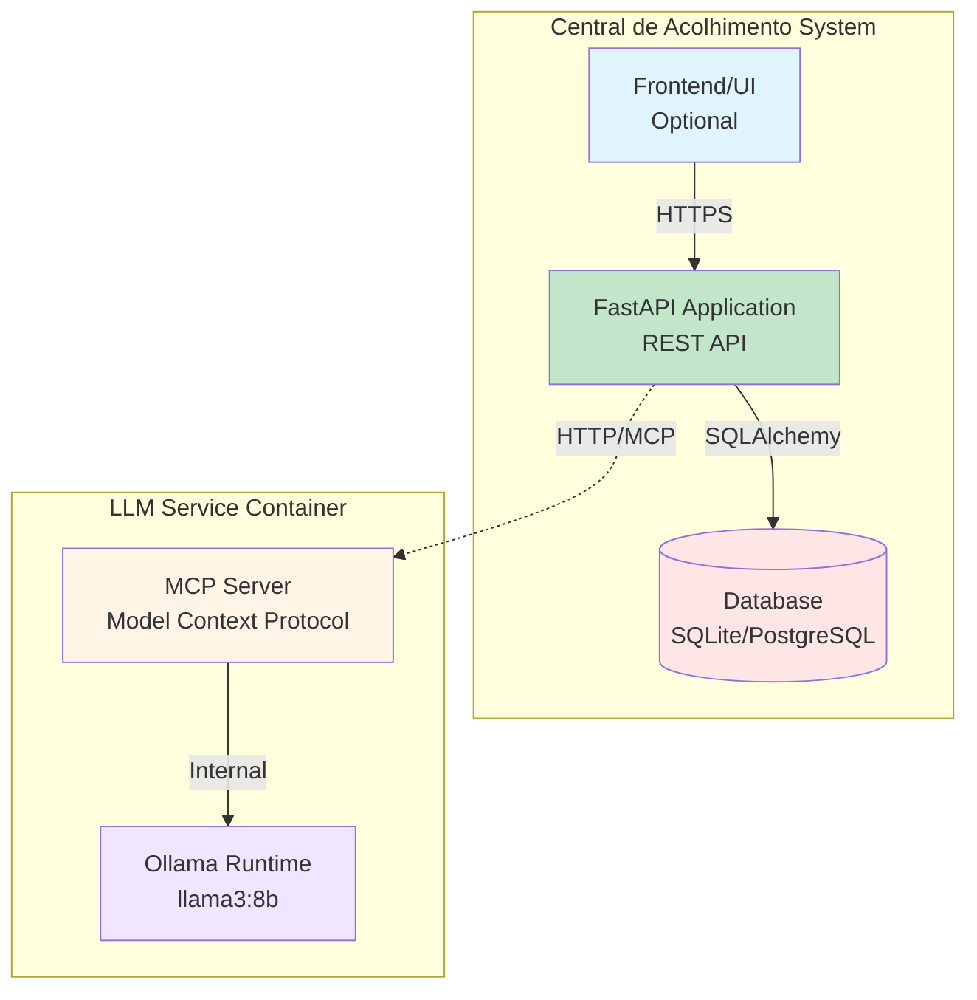

# C4 Level 2: Container Diagram

## Containers

## Container Details

### Central de Acolhimento API
- **Technology**: FastAPI (Python 3.11+)
- **Responsibilities**:
  - Expor endpoints REST para CRUD de contatos
  - Validação de input via Pydantic
  - Autenticação JWT (produção)
  - Integração com LLM via MCP client
  - Persistência via SQLAlchemy

### LLM Service Container
- **Technology**: Ollama + MCP Server
- **Responsibilities**:
  - Receber requests MCP JSON-RPC
  - Processar textos via Llama3:8b
  - Extrair entidades estruturadas
  - Retornar JSON válido

### Database
- **Technology**: SQLite (dev) ou PostgreSQL (prod)
- **Responsibilities**:
  - Persistência de contatos
  - Suporte a migrations via Alembic
  - Backup automático (produção)

## Communication Patterns

### API → Database
- **Protocol**: SQL via SQLAlchemy ORM
- **Pattern**: Repository pattern
- **Connection**: Connection pooling (pool_size=10)

### API → LLM Service
- **Protocol**: HTTP JSON-RPC (MCP)
- **Pattern**: Request/Response assíncrono
- **Timeout**: 30s com retry (3 tentativas)

## Deployment
- API: Kubernetes Deployment (3 replicas)
- LLM: Kubernetes StatefulSet (1 replica com PVC)
- Database: Managed PostgreSQL (RDS, Cloud SQL) ou StatefulSet
