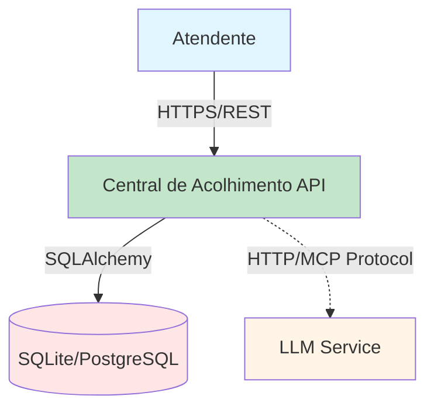

# C4 Level 1: System Context Diagram

## Context Diagram

## Diagram Description

### Actors
- **Atendente**: Usuário principal que cadastra contatos via API REST

### System
- **Central de Acolhimento API**: Sistema principal que expõe endpoints REST para CRUD de contatos

### External Systems
- **LLM Service**: Serviço externo (containerizado) que processa linguagem natural para extração de entidades
- **SQLite/PostgreSQL**: Banco de dados para persistência de contatos

### Relationships
- Atendente → API: Comunicação HTTPS/REST para cadastrar e consultar contatos
- API → DB: Operações CRUD via SQLAlchemy ORM
- API → LLM: Comunicação HTTP usando Model Context Protocol (MCP) para extração de entidades

## Notes
- LLM service é containerizado separadamente (via Docker)
- Comunicação API ↔ LLM é assíncrona via HTTP
- Database pode ser SQLite (dev) ou PostgreSQL (produção)
