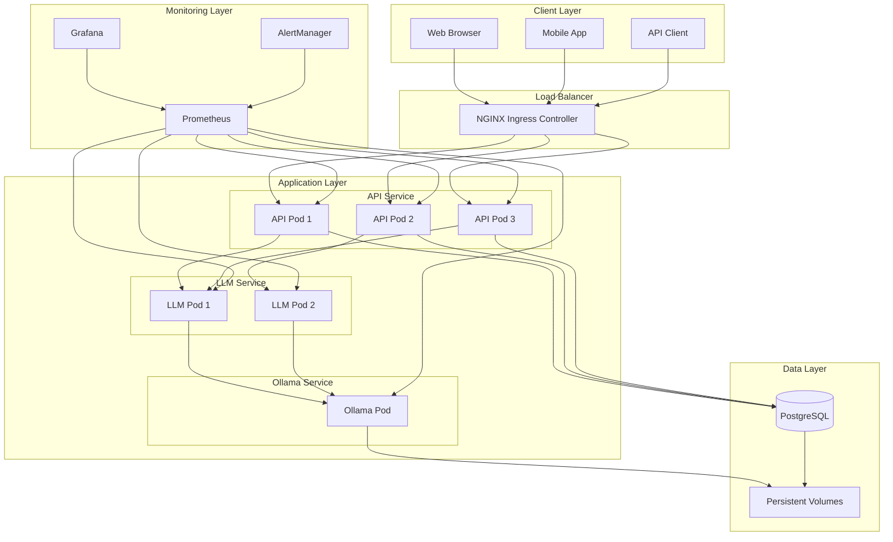
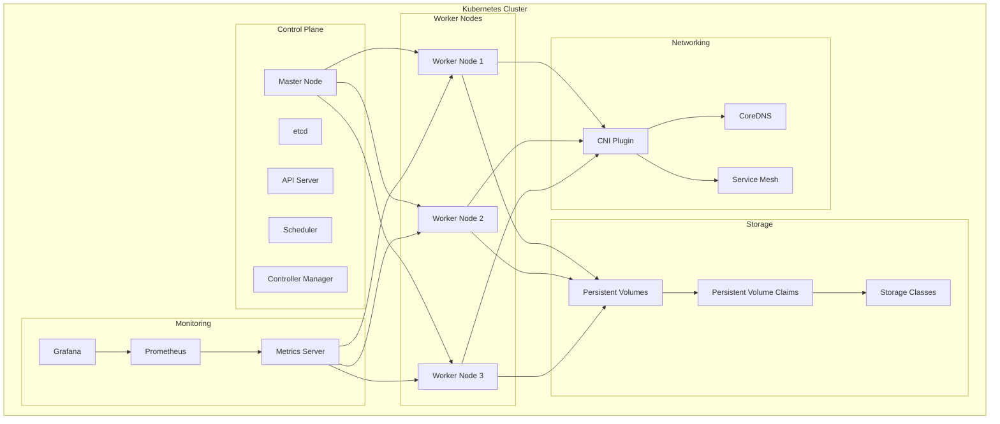
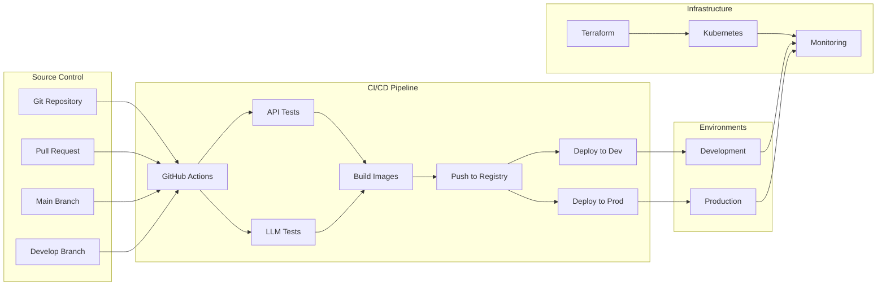
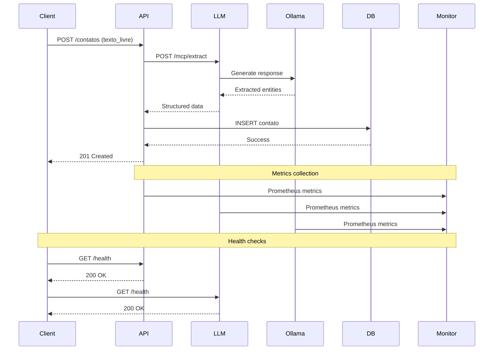
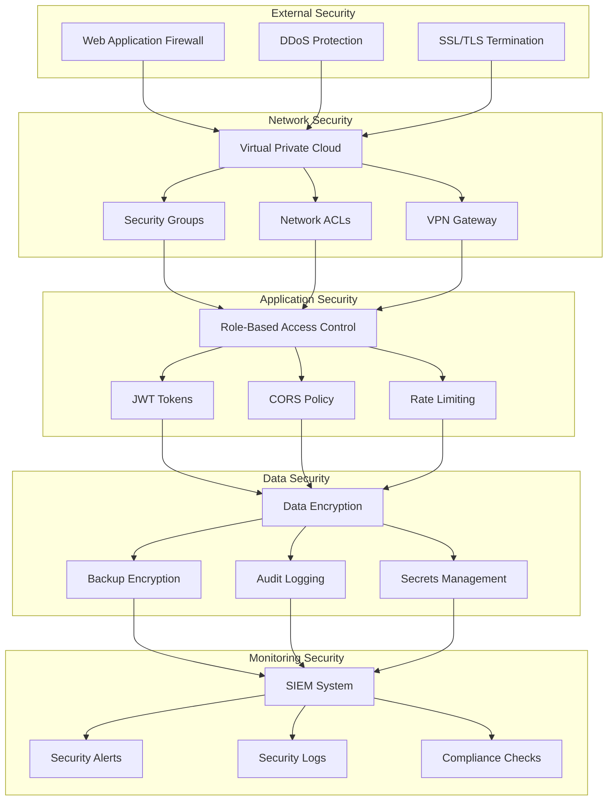
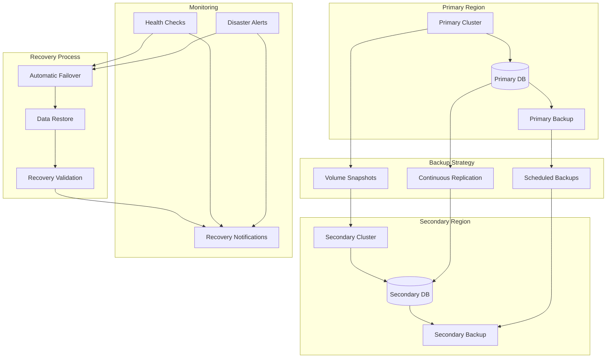

# Central de Acolhimento - Deployment Diagrams
# Mermaid diagrams for deployment visualization

## System Architecture Overview

## Kubernetes Cluster Architecture

## CI/CD Pipeline Flow

## Data Flow Architecture

## Security Architecture

## Disaster Recovery Architecture

